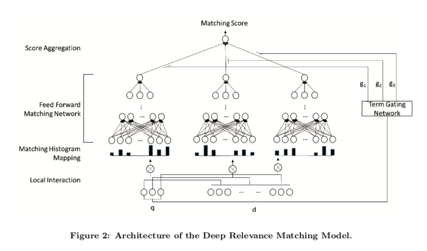
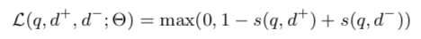
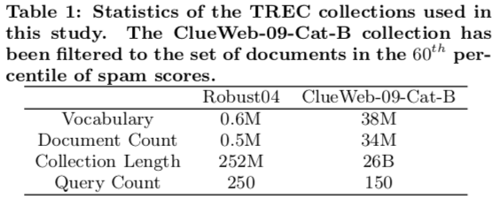
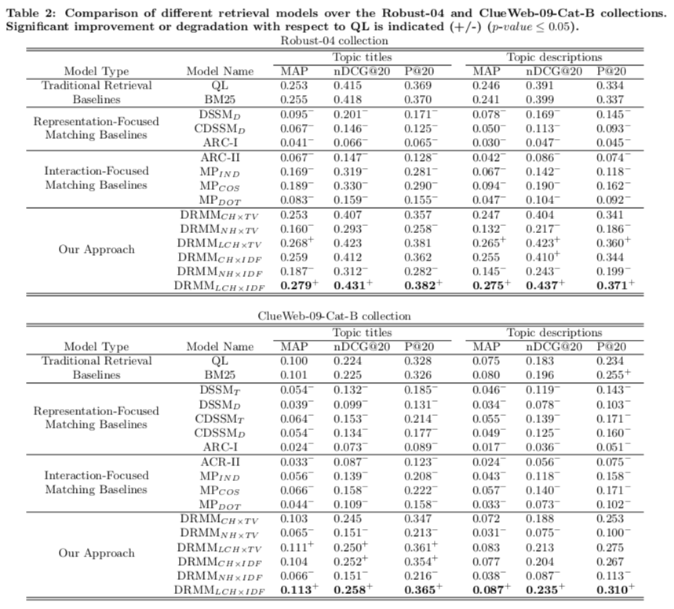

## A Deep Relevance Matching Model for Ad-hoc Retrieval

---

#### [Jiafeng Guo, Yixing Fan, Qingyao Ai, W. Bruce Croft. "A Deep Relevance Matching Model for Ad-hoc Retrieval". Proceedings of the 25th ACM International on Conference on Information and Knowledge Management. 2016, p.55-64.](http://www.bigdatalab.ac.cn/~gjf/papers/2016/CIKM2016a_guo.pdf)

---
### 概要

- Deep NN は computer vision や NLPタスクで大きな成果．
- しかし，ad-hoc retrieval では成果は少ない．
- ad-hoc retrieval と NLP の semantic retrieval は似ているが根本が異なる．
- 本論文はDRMMを提案．

---
### 論文の貢献

1. semantic マッチングとrelevance マッチングの間の3つの大きな違いを指摘．それはディープマッチングモデルの著しく異なるアーキテクチャ設計につながるかも．
2. relevanceマッチングの3つの重要な要素を明示的に扱うことによってad-hoc検索のための新しいDeep relevanceマッチングモデルを提案．
3. State-of-the-artな結果を出した．

---
### MATCHING PROBLEM としてのAD-HOC RETRIEVAL

Deep matching modelは2つのタイプに分類される
1. The representation-focused model                       
ディープニューラルネットワークを用いて単一のテキストのための良い表現を構築しようとし，次に2つの合成表現と抽象テキスト表現の間のマッチングを行う．
1. The interaction-focused model                                    
最初にいくつかの基本的な表現に基づいて2つのテキスト間の局所的な相互作用を構築し，そして次にマッチングのための階層的な相互作用パターンを学ぶためにDeep NNを使用する．

---
### Semantic VS Relevance

#### Semantic Matching
> paraphrase identification, QA, automatching signals　など

2つのtext間の意味関係を推測する
  - Similarity matching signals
  > 単語・フレーズ＆文間の意味的な類似性を捉えることは重要

  - Compositional meaning
  > 文法構造に基づく分の構成的意味を使用する方が有利

  - Global matching requirement
  > 2つのぶんの全体の意味が同じであれば，言い換えと見なせる

#### Relevance Matching

クエリとドキュメントの関連性を推測する
  - Exact matching signals
  > 現代のサーチエンジンにおけるIndexingのために，文書内のtermとクエリ内のtermの正確な一致は依然として最重要

  - Query term importance
  > クエリは短いキーワードからなるため，用語の重要性を考慮に入れるのか重要

  - Diverse matching requirement
  > 関連性のマッチングは，関連文書へどの部分でも発生する可能性があり，全体をクエリに関連させる必要はない

---
### Deep Relevance Matching Model

[code](https://github.com/muramon/research-blog/blob/master/reading/drmm.ipynb)

Relevance Matching 特有の3つの要素を明示的に扱うことにより，Novel Deep マッチングモデルを提案する．

- まず，term embeddings に基づくクエリとドキュメントのそれぞれのterms ペア間のlocal interactionを作る．
- それぞれのクエリについて，variable-length local interaction → fixed-length matching histogram
- ヒストグラムに基づき，Feed forward networkを使用して，階層的なマッチングパターンを学習し，各クエリtermについてマッチングスコアを計算．
- Aggregation weights を計算する，term gating networkで各単一クエリtermからのスコアを集約することで全体のマッチングスコアが生成される

---
### Matching Histogram Mapping

DRMMのinputは，クエリとドキュメントのtermのlocal interaction
- 問題
  - クエリとドキュメントの長さが違うので，local interactionsのサイズは修正されてない
- Previous interaction-based models では，qとdのポジションを維持することで，matching matrixとみなしていた．

→ matching matrix は ad-hoc retrievalには合わない

- Count-based Histogram (CH)

もっとも簡単な手法．それぞれのbinのlocal interactionsのカウントをヒストグラム値に．
- Normalized Histogram (NH)

Local interactionの異なるレベルの絶対数ではなく相対値に焦点を合わせるため，各ビンのカウント値を合計カウントで正規化します。
- LogCount-based Histogram (LCH)

範囲を狭めるため，およびこのモデルが乗算の関係をより簡単に学習できるようにするため，各ビンのカウント値に対して対数を適用する．

---
### Feed forward Matching Network

異なる位置ではなく，異なるレベルのinteraction信号から階層的マッチングパターンを抽出することを目的としている．
- Term Gating Network

クエリtermレベルで共同ディープアーキテクチャを採用している． このようにして，我々のモデルはクエリtermの重要性を明示的にモデル化することができる．これはterm gating networkを使用することによって達成され，それはそのクエリtermに関する関連性スコアが最終的な関連性スコアにどれだけ寄与するかを制御する各クエリtermについての集約重みを生成する． 具体的には，ゲート機能としてsoftmax機能を使用する．

### Term vectors (TV)

ゲーティング関数の入力としてクエリtermベクトルを使用する．
- Inverse Document Frequency (IDF)

Ad-hoc retrievalにおけるtermの重要性を示す重要なシグナルは，文書の逆頻度である．ゲート関数においてこの単純だが強力な信号を試した．

---
### Model Training

- pairwise ranking loss such as hinge loss を使用

> https://en.wikipedia.org/wiki/Hinge_loss

- s(q, d) : 予測された(q, d)のマッチングスコア
- Θ : ネットワークのパラメータ
- 最適化 : Adagrad (mini-batches : 20)
- アーリーストッピング

---
### Experiments
#### Datasets

#### Evaluation Methodology

- mean average precision (MAP)
- normalized discounted cumulative gain at rank 20 (nDCG@20)
- precision at rank 20 (P@20)

---
### Retrieval Performance and Analysis

- 提案されたDRMMsについて

1. NH-based < CH-based < LCH-based
  - NH-basedはnormalization後にドキュメントの長さ情報を失ってしまう
  - LCH-basedは，Deep Neural Networkは，乗法関係の学習に役立つ範囲を狭くした非線型変換による入力信号から恩恵を受けることができる

1. TV < IDF
  - term vectorsはterm importanceについて十分な情報を含んでいない
  - term gating network(TGN)はFFより多くのパラメータがあるのて，TVを使うとTGNによって学習が支配される

- Best performing DRMM : DRMM LCH × IDF

---
### Conclusions

- relevanceマッチングにおける3つの要素を明示的に扱うことによって，ad-hoc検索のための新しいDeep relevanceマッチングモデルを提案する．
- 2つの代表的なベンチマークデータセットの実験結果は，このモデルが従来の検索モデルや最新のディープマッチングモデルよりも著しく優れていることを示している．

[戻る](https://muramon.github.io)
